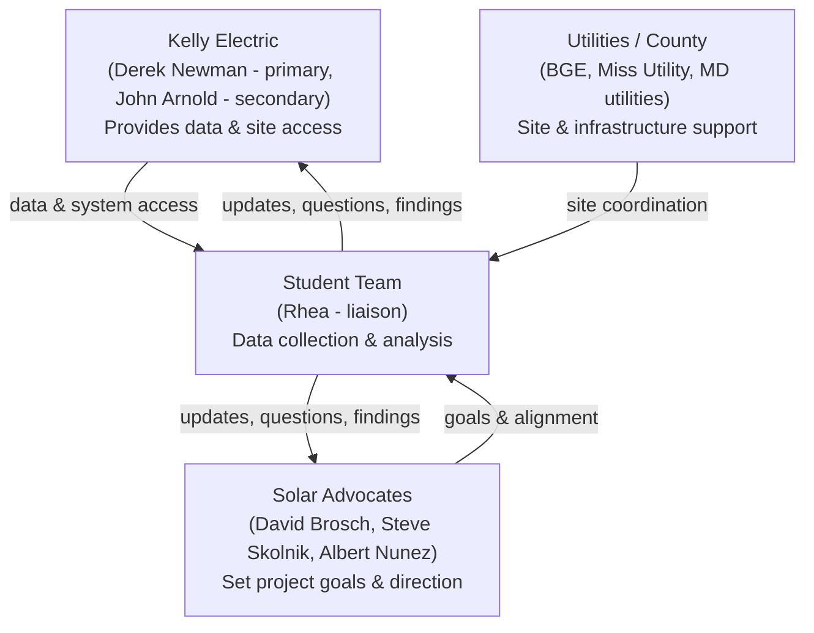

# Stakeholder Management

## The Stakeholder Landscape

The project involved several distinct groups, each with a different role:

A key distinction that wasn't obvious at the start of the project, and that I surfaced through direct conversation with our Kelly Electric contact: **Kelly Electric's role was primarily to provide data and site access, while the solar advocates (David Brosch and colleagues) were the ones setting the project's broader goals and direction.** That clarity came out of a check-in call with Derek Newman on April 10, and it changed how our team routed different kinds of questions going forward.

## Restarting Communication

When our team entered the project on February 9, there wasn't yet an established communication structure. I was designated team liaison on February 16, before we had a primary Kelly Electric contact.

Over the following two weeks:
- Derek Newman was established as Kelly Electric's primary contact (with John Arnold as secondary)
- I helped organize and run our team's first stakeholder meeting
- In the process, we found that the stakeholder group itself hadn't met in some time — our outreach was what got that communication moving again
- I was also in direct contact with David Brosch, one of the solar advocates on the project

## Ongoing Coordination

Through March and April, my responsibilities as liaison included:
- Scheduling and preparing for recurring stakeholder meetings
- Following up directly when a contact was unresponsive (at one point calling Kelly Electric's main line to get Derek Newman's number after email follow-ups stalled, see [Data Access & Blockers](04-data-access-and-blockers.md))
- Routing questions to the right stakeholder group once we understood the Kelly Electric / solar-advocate distinction
- Communicating project status, blockers, and next steps back to the team and to the class/instructor

## Why This Mattered

A project with this many stakeholder groups, a company providing data, a set of advocates setting direction, utilities coordinating physical site work, and a rotating grant timeline — needed someone actively keeping communication moving, not just documenting it after the fact. That was the core of the liaison role.
