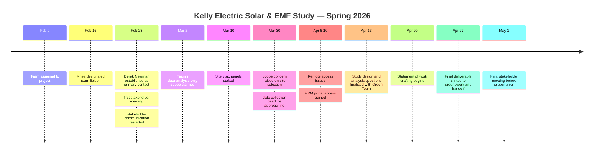

# Project Timeline

## Phase 1: Initiation (Feb 9 – 16)
Team assigned to the Kelly Electric project. Rhea designated team liaison on Feb 16, before a primary contact existed. GIS modeling introduced as an early contingency idea in case data collection was delayed.

## Phase 2: Stakeholder & Site Setup (Feb 23 – Mar 12)
Derek Newman established as primary Kelly Electric contact; first stakeholder meeting held, restarting a stakeholder relationship that had gone quiet. Site visitation on March 10 to stake out three test sites and begin panel installation.

## Phase 3: Deadline Pressure & Scope Clarification (Mar 23 – 30)
Installation still incomplete as the grant-driven March 31 data-collection deadline approached. Scope concern raised and resolved regarding site-selection work drifting outside the team's role (see [Scope Management](03-scope-management.md)).

## Phase 4: Access Recovery (Apr 6 – 10)
Extended troubleshooting to get working remote access to the data systems (TeamViewer → Splashtop → live monitoring link → VRM portal), including a period where the primary contact was unreachable by email (see [Data Access & Blockers](04-data-access-and-blockers.md)).

## Phase 5: Analysis Planning (Apr 13)
Met with the "Green Team" to finalize the study's core analysis questions and confirm the data sources and visualization approach for the planned comparison across the three sites.

## Phase 6: Pivot to Handoff (Apr 20 – 27)
With EMF data still delayed, the team began drafting a statement of work for future capstone teams as a parallel track to the (now unlikely) full analysis. By April 27, the team confirmed the final presentation would focus on groundwork and organization rather than analytical findings, and that a full data analysis would not be possible this semester.

## Phase 7: Final Presentation (May 1 onward)
Final stakeholder meeting held, and the final slide deck presented — framed around the groundwork completed and the handoff to future teams.
